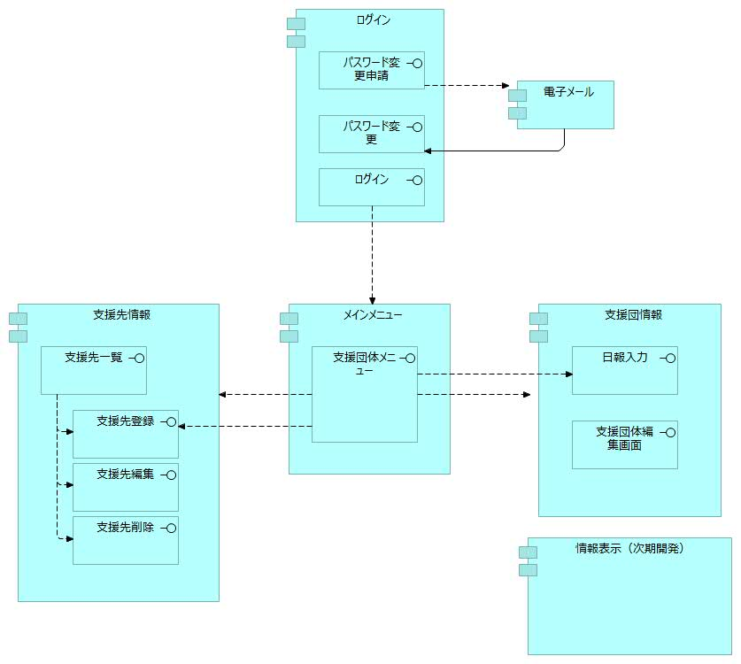
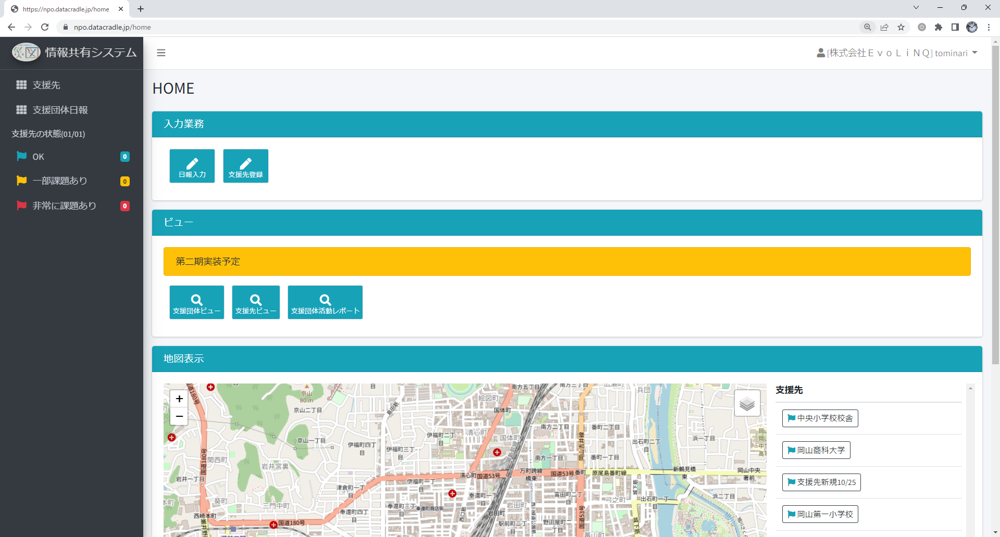

:doctype: book
= 災害支援団体情報共有システム災図(SIZU) 操作説明書
:lang: ja
:author: 特定非営利活動法人 岡山NPOセンター / 株式会社ＥｖｏＬｉＮＱ / 一般社団法人データクレイドル
:email: info@evolinq.link
:docdate: date (ISO)
:toc: left
:toclevels: 6
:toc-title: 目次
:version-label: 1.0
:revnumber: 0.0
:docname: 災害支援団体情報共有システム　災図(SIZU) 操作説明書
:revdate: 2022/12/28
:sectnumlevels: 5
:sectnums:
:chapter-signifier:

== はじめに
本書は、災害支援団体情報共有システム　災図(SIZU) の操作説明書です。
災図は、支援団体さま日報データをデジタルデータとして管理し、支援関係者間での情報共有・活用するシステムです。
災図には、以下の機能があります。

. 日報入力機能 +
日報入力機能では、パソコン・タブレット等を使って、簡単に支援活動の日報を入力することができます。
入力したデータは、検索・閲覧することができ、支援活動に役立てることができます。

. 支援先機能 +
支援先機能では、避難所などの支援先の情報を災図利用者同士で共有することができます。

また、2023年5月までに以下の機能を実装する予定です。

. 支援団体ビュー +
支援団体のタイムラインを表示します。

. 支援先ビュー +
支援先のタイムラインを表示します。

. 支援団体活動レポート +
支援団体の日報のレポート表示します。

== システム運用について
災図は、特定非営利活動法人 岡山NPOセンターが運用しています。
支援団体さまには、システムを活用し、効率的に業務記録を残しながら、情報共有や情報活用いだけるシステムとなっております。
システムについての要望・質問は、お問い合わせフォームをご利用ください。
システム開発のアドバイザーには、一般社団法人 情報支援レスキュー隊(ITDART)が参画しています。
なお、システム開発は、株式会社ＥｖｏＬｉＮＱ / 一般社団法人 データクレイドルで行っております。

image:img/operation.jpg[width="80%"]

== システム利用登録
システムの登録には、メールアドレスが必要になります。１つの団体につき、１メールアドレスを登録することが可能です。
以下のフォームから登録してください。

https://forms.office.com/r/hMVVb3sJXW

== 操作方法
災図の操作方法は、以下のとおりです。

=== 画面遷移図
災図の画面遷移図は。以下のとおりです。

<<<<

=== システムログイン
災図を利用するには、WEBブラウザを使って、以下のURLを開いてください。 + 
https://npo.datacradle.jp/login

image:img/login.png[width="80%"]

. メールアドレスに利用者登録した際のメールアドレスを入力してください。
. パスワードには、利用者登録した際のパスワードを入力してください。

NOTE: 推奨WEBブラウザは以下のとおりです(最新版をお使いください)。

* マイクロソフト Edge(Chromium版)
* Google Chrome
* Apple Safari(macOSのみ)

<<<<

=== トップ画面
システムにログインすると、トップ画面を表示します。

トップ画面の構成は、以下のとおりです。

==== サイドメニュー
サイドメニューでは、利用する機能を選択できます。また、下部には、支援先の状況を信号機を模した、"青色"、"黄色"、"赤色"で表示します。

. 支援先 +
支援先情報画面を表示します。

. 支援団体日報 +
支援団体日報画面を表示します。

==== メイン画面
メイン画面では、以下の機能が利用できます。

===== 入力業務
. 日報入力 +
支援団体情報の日報入力画面へ遷移します。

. 支援先登録
支援先情報を支援先登録画面へ遷移します。

===== ビュー
ビューは、第二期(2023年5月末)までに開発を予定しております。

=== 支援団体日報
支援団体日報機能では、支援団体の日報を登録、閲覧および削除を行います。

==== 支援団体日報画面
支援団体日報では、支援団体の日報を検索表示し、一覧表示します。一覧表示した日報は、編集、削除が可能です。

image:img/groupinfo1.png[width="80%"]

支援団体日報画面では、以下の条件で支援団体日報を検索することができます。

. キーワード + 
支援団体日報のメモ欄の中から、キーワードで検索を行います。

. 支援先 + 
日報を登録した支援団体を指定して、日報を検索します。

. <<コード-支援種別,支援種別>> + 
日報の支援種別を指定して、日報を検索します。

. <<コード-状態,状態>> + 
日報の(避難先)状態を指定して、日報を検索します。

. 支援開始日、支援終了日 + 
日報の支援日を指定して、日報を検索します。開始・終了の範囲を指定して、日報を検索します。

. タグ + 
日報に設定した”タグ”を指定して、日報を検索します。
. 検索 +
設定した条件で支援団体日報を検索します。
. CSV出力 +
指定した条件で支援団体日報をCSV出力します。
. 新規登録 + 
新規に日報入力画面を表示します。
. 一覧表示
.. 支援日 +
当該日報の支援日を表示します。
.. 支援団体 +
当該日報の支援団体を表示します。
.. 支援先 +
当該日報の支援団体を表示します。
.. 支援種別 +
当該日報の支援種別と状況を表示します。
.. 操作
... 編集 +
一覧表示されている日報を編集するため、日報入力画面を表示します。
... 削除 +
一覧表示されている日報を削除します。

<<<<

==== 日報入力
支援団体の日報を入力します。新規登録の場合、各項目は初期値で表示します。編集の場合、編集対象のデータを初期値として表示します。

image:img/groupreport1.png[width="80%"]

日報入力では、以下の項目を入力します。

. 支援団体 +
  支援団体名称(表示のみ)
. 災害情報 + 
  当該日報の災害名を設定します。災害名は、システム運用者(岡山NPOセンター)で設定登録したものが選択できます。
. 支援先 +
  当該日報の支援先を設定します。支援先は、登録済みのみ選択できます。支援先が無い場合、<<支援先登録 ,支援先登録機能>>で追加することができます。 + 
  「過去に入力した支援先のみを選択肢に表示する」をチェックすると以前に支援を行ったことがある支援先から簡単に選択ができます。 + 
  「地図検索」を選択すると、画面上に地図を表示し、位置から支援先を選択できます。 +
  image:img/map.png[align="center", width="50%"]
. 支援日 + 
  日報の日付を入力します。入力は、キーボードからの入力、マウスからの入力ができます。 +
  image:img/calendar.png[align="center", width="50%"]

. 記入者 +
  日報を入力する人の名前を入力します。 + 
  「過去に入力した記入者から選択する」をチェックすると以前に入力したことがある人の名前をリストから選択できます。
. タグ + 
  検索用の”タグ”を入力します。タグは、運用する人たちで自由に決めることができます。
. 情報共有会議用メモ + 
  情報共有会議で報告する内容を記入します。ここには、他の支援団体も公開する情報を入力してください。
. 支援先状況 + 
  支援先の状況から、支援した種別をチェックします。種別をチェックすると、種別ごとに状況選択、メモ入力をすることができます。 + 
  image:img/status_input.png[width="80%"]
. 内部用メモ +
  入力する自団体向けのメモを入力します。この情報は、他の団体には公開されません。

<<<<

=== 支援先情報
支援先情報では、支援先情報を検索表示し、一覧表示します。一覧表示した支援情報は、編集、削除が可能です。

image:img/destinfo1.png[width="80%"]

支援先情報画面では、以下の条件で支援先を検索することができます。

. キーワード + 
支援先の情報からキーワードで部分一致検索します。
. 都道府県 + 
支援先を都道県指定で検索します。
. <<コード-支援種別,支援種別>> + 
支援種別が登録されている支援先を検索します。
. <<コード-状態,状態>> + 
状態が登録されている支援先を検索します。
. 支援開始日、支援終了日 + 
当該支援先に対する日報の支援日を指定して、日報を検索します。開始・終了の範囲を指定して、日報を検索します。
. 有効/支援終了 +
支援が続いている支援先、支援が終了している支援先を指定して検索します。
. 検索 +
設定した条件で支援先を検索します。
. CSV出力 +
指定した条件で支援先をCSV出力します。
. 新規登録 + 
新規に支援先登録画面を表示します。
. 一覧表示
.. ステータス +
当該支援先で、支援を継続しているのか、支援を終了しているのかを表示します。
.. 支援の状態 +
当該支援先の支援種別、支援の状態を表示します。
.. 都道府県 +
支援先の所在地（都道府県）を表示します。
.. 市町村 +
支援先の所在地（市町村）を表示します。
.. 名称 +
支援先の名称を表示します。
.. 操作
... 編集 +
一覧表示されている支援先を編集するため、支援先登録画面を表示します。
... 削除 +
一覧表示されている支援先を削除します。

==== 支援先登録[[支援先登録]]
支援先の情報を入力します。新規登録の場合、各項目は初期値で表示します。編集の場合、編集対象のデータを初期値として表示します。

image:img/destentry1.png[width="80%"]

支援先登録では、以下の項目を入力します。

. ステータス +
支援先への支援が続いている場合、「有効」をチェックします。
. 指定避難場所 +
支援先が指定避難場所の場合、チェックします。
. 名称 +
支援先の名称を入力します。
. 名称カナ +
支援先の名称のカナをカタカナで入力します。
. 市町村 +
支援先所在地の都道府県、市町村をリストから選択します。
. 住所（町丁目以降） +
支援先所在地の住所（町丁目以降）を入力します。
. 方書 +
支援先所在地の建物名称などを入力します。
. 代表者 +
支援先の代表者を入力します。
. 電話番号 +
支援先の電話番号を入力します。
. 内線番号 +
支援先の内線番号を入力します。
. 緯度経度 +
支援先の位置を緯度経度で入力します。緯度経度は、直接入力の他、地図上で選択ができます。地図上で選択する場合、地図中心のピンに位置を合わせることで、緯度経度が自動で設定されます。
. 標高 +
施設の標高を入力します。

image:img/destentry2.png[width="80%"]

13.指定支援先との重複 +
指定支援先と重複がある場合、その旨を自由入力します。

14.想定収容人数 +
支援先に収容可能な人数を自由入力します。数量のみでなく、文字も入力することができます。

15.対象となる町内会・自治会　+
支援先に関連する町内会、自治会などを入力します。

16.URL +
支援先に関連するURlがある場合、入力します。

17.備考
支援先についての備考などを自由に入力します。

== コード

=== 支援種別[[コード-支援種別]]
支援種別では、支援を何種類かに区分した値を使います。支援種別の内容は、以下のとおりです。支援種別は、必要に応じて、システムを運用する岡山NPOセンターによる追加、修正、削除される場合があります。

. 運営支援	
. 環境・衛生
. 物資
. 食事・炊き出し
. その他

=== 状態[[コード-状態]]
状態は、支援先の状態は表わすコードです。状態は、システム固定となっています。

. OK + 
支援先に問題がない場合に選択します。
. 一部課題あり +
支援先の少し課題があるときに選択します。

. 非常に課題あり +
支援先が早急に対応する課題があるときに選択します。

== システムについてのお問い合わせ先
システムについてのお問い合わせは、以下のURLから登録をお願いします。

https://forms.office.com/r/BcYahiTsMU

image:img/question.png[]
