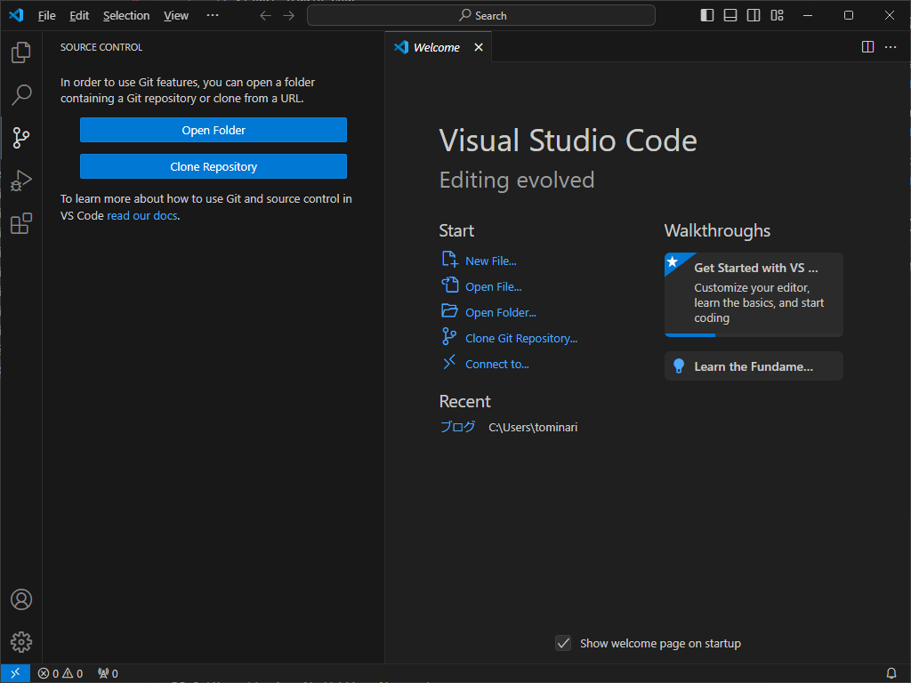

# 災図の開発環境構築方法(Windows版)
以下は、Windows11で試した例です。

## 必要なソフトウェアとインストール・設定方法
1. Visual Studio Code
こちらのサイトやMicrosoft Storeからインストールします。
https://code.visualstudio.com/Download

2. xampp
以下のサイトを参考に、XAMPPをインストールしてください。
https://www.evolinq.link/ja/evolution-linked-records/xampp%E3%81%AE%E3%82%A4%E3%83%B3%E3%82%B9%E3%83%88%E3%83%BC%E3%83%AB%E8%A8%98%E9%8C%B2

3. githubのアカウントを作る
   こちらを参考にGithubのアカウントを作成してください。
   https://www.evolinq.link/ja/evolution-linked-records/github-%E3%82%A2%E3%82%AB%E3%82%A6%E3%83%B3%E3%83%88%E3%81%AE%E4%BD%9C%E6%88%90%E6%96%B9%E6%B3%952024/8/18%E7%89%88

## 災図のレポジトリをforkします
githubにあるプログラム等を保管する場所をリポジトリといいます。 <br>
リポジトリを複製して、自分用の保管場所を作成することをforkとします。<br>
forkの仕方は、以下の通りです。
1. githubにログインします。

2. 災図のリポジトリ(https://github.com/KishiYuuki/saiz)を開きます。
3. forkボタンを押します。
   
4. 以下の画面が表示されます。デフォルトのまま、"Create fork"ボタンを押します。
    
5. しばらくの時間待つと、自分用のリポジトリが出来上がります。

## githubのアクセス設定
1. SSHキーの設定をします。以下の例を参考に、設定してください。
```
PS C:\Users\tominari> ssh-keygen -t rsa -b 4096 -C "tominari@evolinq.link"
Generating public/private rsa key pair.
Enter file in which to save the key (C:\Users\tominari/.ssh/id_rsa):
Enter passphrase (empty for no passphrase):*******←ここに新たに設定するパスワード
Enter same passphrase again:*******←ここに上と同じパスワード
Your identification has been saved in C:\Users\tominari/.ssh/id_rsa
Your public key has been saved in C:\Users\tominari/.ssh/id_rsa.pub
The key fingerprint is:
SHA256:yRoOaoNWyZqrGNsa2tg87LUeOBUW7JfHFWNnrxc1TQ4 tominari@evolinq.link
The key's randomart image is:
+---[RSA 4096]----+
|   ..     +.o Eo+|
|    ..   ..+ . +o|
|   .o  o .    o .|
|  ..o.o.o.   . . |
|   +o...S   . .  |
| .++ o o     .   |
|+=* o o          |
|+@++ o           |
|O+*oo            |
+----[SHA256]-----+
PS C:\Users\tominari>
```

2. 生成したパブリックキーを確認します。上の例では、C:\Users\tominari/.ssh/id_rsa.pubにあります。中身を確認するには、以下のコマンドを実行します。
```
PS C:\Users\tominari>type C:\Users\tominari/.ssh/id_rsa.pub
ssh-rsa *(文字の羅列)
******************************************
******************************************
******************************************
******************************************
evolinq.link
```
3. githubの右上のアイコンから、"Settings"メニューを選択します。
    
4. githubの左サイドメニューから、"SSH and GPG Keys"メニューを選択します。
    
5. "New SSH Keys"ボタンを押します。
    
この部分をコピーしておきます。
6.  タイトルに適当な名前、Key typeは"Authentication Key"、Keyには先ほどコピーした"C:\Users\xxxxx/.ssh/id_rsa.pub"ファイルの中身をコピーします。
 

## 災図に本体を入手する
1. まず、Visual Studio Code を起動します。
2. "Clone Repository"を選択します。
    
3. 画面の上部に現れる入力欄に、"git@github.com:（ユーザ名）/saiz.git"を入力します。
    
4. インターネットのgithubから、自分のコンピューターにコピーする先のフォルダを指定します。フォルダを指定したら、"Select as Repository Destination"ボタンを押します。今回の例では、"C:\saiz"を指定します。
    
5. 画面上部にパスワードを求められます。SSHを作成した時のパスワードを入力してください。
       
6. githubからのコピーが終わると、以下のウィンドウが表示されます。
    

7. セキュリティの確認が表示されるので、"Yes, I trust the authors"を選択します。
    

## 災図を開発用のWEBサーバーに公開する
1. Apacheを"stop"ボタンを押します。
   
2. "config"ボタンを押して、Apache(httpd.conf)を選びます。
    
3. メモ帳が表示されるので、以下の点を修正します。
【変更前】
```
#
# DocumentRoot: The directory out of which you will serve your
# documents. By default, all requests are taken from this directory, but
# symbolic links and aliases may be used to point to other locations.
#
DocumentRoot "C:/xampp/htdocs"
<Directory "C:/xampp/htdocs">

```
【変更後】
DocumentRootにダウンロードしてきたフォルダの"public"部分を指定します。
```
#
# DocumentRoot: The directory out of which you will serve your
# documents. By default, all requests are taken from this directory, but
# symbolic links and aliases may be used to point to other locations.
#
DocumentRoot "C:\saiz\saiz\public"
<Directory "C:\saiz\saiz\public">
```

## 災図のセットアップ
githubからcloneした災図を以下の手順で起動できるようにします。

1. XAMPPのControl Panelを開きます。


2. 右上にある"Shell"ボタンをクリックします。


3. Composerというソフトウェア管理ツールをインストールします。
```
tominari@WIN11 c:\saiz\saiz
# curl -sS https://getcomposer.org/installer | php
All settings correct for using Composer
Downloading...

Composer (version 2.7.8) successfully installed to: C:\saiz\saiz\composer.phar
Use it: php composer.phar
```

4. Composerを使って関連するソフトウェアをインストールします。

```
tominari@WIN11 c:\saiz\saiz
# php composer.phar update

```

5. 設定ファイルを更新します。まず、.env.sampleから、使用する設定ふぁいうを作成します。
```
tominari@WIN11 c:\saiz\saiz
# copy .env.example .env
        1 個のファイルをコピーしました。
```

6. mysqlの設定をします。変更が必要なのは、DB_DATABASE, DB_USERNAME, DB_PASSWORDです。DB_DATABASEは、githubには'SIZU'になっているのですが、システム名に合わせて'saiz'とします。 
```
DB_CONNECTION=mysql
DB_HOST=127.0.0.1
DB_PORT=3306
DB_DATABASE=saiz
DB_USERNAME=tominari
DB_PASSWORD=1001tomi
```

7. データベースのユーザー、パスワードを作成し、データベース'saiz'への権限を付与します。
```
tominari@WIN11 c:\saiz\saiz
# mysql -u root
Welcome to the MariaDB monitor.  Commands end with ; or \g.
Your MariaDB connection id is 12
Server version: 10.4.32-MariaDB mariadb.org binary distribution

Copyright (c) 2000, 2018, Oracle, MariaDB Corporation Ab and others.

Type 'help;' or '\h' for help. Type '\c' to clear the current input statement.

MariaDB [(none)]> create database saiz;
Query OK, 1 row affected (0.004 sec)

MariaDB [(none)]> CREATE USER 'tominari'@'localhost' IDENTIFIED BY  '1001tomi';
Query OK, 0 rows affected (0.039 sec)

MariaDB [(none)]> GRANT ALL PRIVILEGES ON saiz.* TO 'tominari'@'localhost';
Query OK, 0 rows affected (0.035 sec)

MariaDB [(none)]> \q
``` 

8. フレームワーク Laravelのキーを作成します。
```
tominari@WIN11 c:\saiz\saiz
# php artisan key:generate
Application key set successfully.

# php artisan config:cache
Configuration cache cleared!
Configuration cached successfully!

```

9. 災図の初期データベースを作成します。
```
tominari@WIN11 c:\saiz\saiz
# php artisan migrate
Migration table created successfully.
Migrating: 2014_09_09_102328_create_organizations_table
Migrated:  2014_09_09_102328_create_organizations_table (37.17ms)
Migrating: 2014_10_12_000000_create_users_table
…
Migrating: 2024_04_03_113813_add_columns_to_users
Migrated:  2024_04_03_113813_add_columns_to_users (37.47ms)

```

11. 災図のデータベースに初期データを投入します。
``` 
tominari@WIN11 c:\saiz\saiz
# php artisan db:seed
Seeding: Database\Seeders\DisasterTypeSeeder
Seeded:  Database\Seeders\DisasterTypeSeeder (148.44ms)
Seeding: Database\Seeders\LocalGovernmentSeeder
Seeded:  Database\Seeders\LocalGovernmentSeeder (204.20ms)
Seeding: Database\Seeders\PrefectureSeeder
Seeded:  Database\Seeders\PrefectureSeeder (18.64ms)
Database seeding completed successfully.

tominari@WIN11 c:\saiz\saiz
# php artisan db:seed --class=DevDataSeeder
Database seeding completed successfully.
``` 

12. Apacheの行で、'Stop' → 'Start'を押して、Apacheを再起動します。


1.  http://localhostをひらきます。


初期状態での管理ユーザーは、ando2@d-cradle.or.jp
パスワードは、Test0001です。

